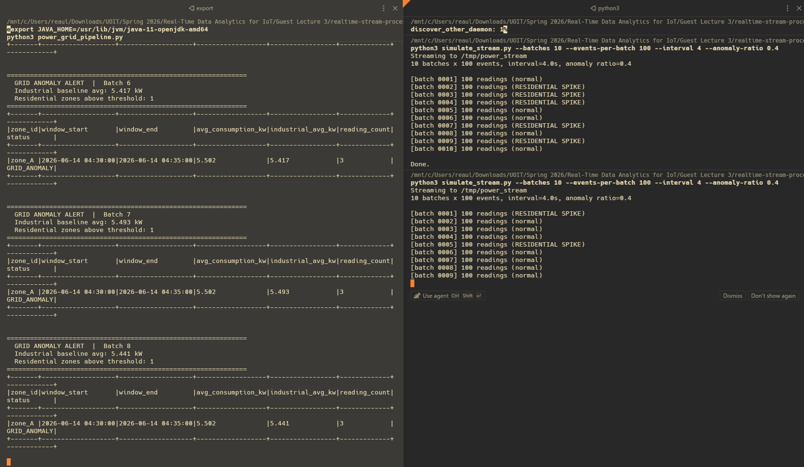
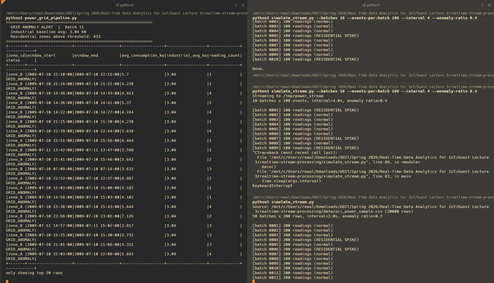
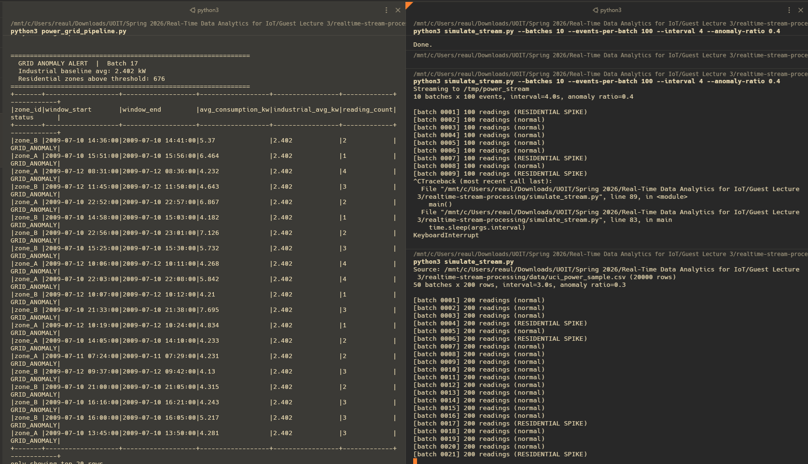

# Smart Power Grid Anomaly Detection

Real-time streaming pipeline that detects residential zones whose power consumption unexpectedly exceeds industrial levels. Built with PySpark Structured Streaming.

**Course:** ENGR 5785G - Real-time Data Analytics for IoT  
**Scenario:** D - Smart Power Grid  
**Dataset:** [UCI Household Power Consumption](https://archive.ics.uci.edu/dataset/235/individual+household+electric+power+consumption)

## Architecture

```
simulate_stream.py                    power_grid_pipeline.py
       |                                       |
  Write CSV batches                     readStream (watched dir)
       |                                       |
       v                                Join with zone_mapping.csv  (stream-static)
  /tmp/power_stream/  ------>                  |
                                        withWatermark (10 min)
                                               |
                                        Sliding window (5 min / 1 min)
                                        groupBy(zone_id, zone_type)
                                               |
                                        avg(global_active_power)
                                               |
                                        foreachBatch: residential vs industrial
                                               |
                                        GRID_ANOMALY alert to console
```

The pipeline processes a 20,000-row sample from the UCI Household Power Consumption dataset. Each reading is assigned to one of 16 smart meters spread across 4 zones (2 residential, 2 industrial). Industrial meter readings are scaled up by 3.5x to reflect higher baseline consumption. The simulator chunks this sample into batches and injects anomalous residential spikes in a configurable fraction of batches so the alert condition fires visibly.

## Quick Start (Docker)

No setup needed. Just Docker.

```bash
docker compose up --build
```

This builds a container with Java 17 and PySpark, starts the pipeline, feeds it simulated data, and prints alerts to the console. Takes about 2 minutes end to end.

## Manual Setup

If you prefer running without Docker:

### Prerequisites

- Python 3.8+
- Java 11 or 17 (required by PySpark)
- PySpark 3.5+

On Ubuntu/Debian, install Java with:
```bash
sudo apt-get install -y openjdk-17-jdk-headless
```

### Install dependencies

```bash
cd realtime-stream-processing
pip install -r requirements.txt
```

### Run

Open two terminals in the project root.

**Terminal 1 - start the pipeline:**
```bash
python power_grid_pipeline.py
```

**Terminal 2 - start the simulator:**
```bash
python simulate_stream.py
```

The pipeline prints an alert whenever a residential zone's average consumption exceeds the industrial average within the same sliding window.

### Simulator options

| Flag | Default | Description |
|------|---------|-------------|
| `--max-batches` | 50 | Stop after this many batches (0 = use all data) |
| `--rows-per-batch` | 200 | Readings per batch file |
| `--interval` | 3.0 | Seconds between batches |
| `--anomaly-ratio` | 0.3 | Fraction of batches with residential spikes |

Example streaming all 20,000 rows:
```bash
python simulate_stream.py --max-batches 0 --rows-per-batch 200 --interval 2
```

## Sample Alert Output

```
==============================================================
  GRID ANOMALY ALERT  |  Batch 7
  Industrial baseline avg: 1.637 kW
  Residential zones above threshold: 2
==============================================================
+-------+-------------------+-------------------+------------------+-----------------+-------------+------------+
|zone_id|window_start       |window_end         |avg_consumption_kw|industrial_avg_kw|reading_count|status      |
+-------+-------------------+-------------------+------------------+-----------------+-------------+------------+
|zone_A |2009-07-10 06:02:00|2009-07-10 06:07:00|4.219             |1.637            |4            |GRID_ANOMALY|
|zone_B |2009-07-10 06:19:00|2009-07-10 06:24:00|4.222             |1.637            |1            |GRID_ANOMALY|
+-------+-------------------+-------------------+------------------+-----------------+-------------+------------+
```

## Written Explanation

### Why a sliding window?

A sliding window (5 minutes wide, advancing every 1 minute) was chosen over a tumbling window for two reasons:

1. **Earlier detection.** A tumbling window reports once every 5 minutes. If a residential zone starts spiking at minute 2, the alert does not fire until minute 5. The sliding window recomputes every minute, so the spike shows up in the very next update.

2. **Smoother trend visibility.** Each reading contributes to up to 5 overlapping windows. This dilutes short transient spikes across multiple windows while still catching sustained anomalies. A single outlier reading cannot dominate a window the way it might in a small tumbling window.

For grid monitoring, where operators need to respond before equipment is damaged, the 1-minute update cadence is much more practical than waiting for a tumbling window to close.

### Where the pipeline requires state

**Stateful operations:**

- **Sliding window aggregation** (`groupBy` + `window` + `avg`): Spark maintains partial sums and counts for every active `(zone_id, window_start, window_end)` combination in its state store. With a 5-minute window sliding every minute, each incoming event falls into up to 5 overlapping windows, all of which must be tracked simultaneously. This is the primary source of state in the pipeline.

- **Watermark tracking:** Spark tracks the maximum observed `event_time` across all partitions to decide when old window state can be safely discarded. The 10-minute watermark means Spark keeps window state for 10 minutes past the window's close before dropping it, which bounds memory usage on long-running streams.

**Stateless operations:**

- **Stream-static join:** Enriching each meter reading with zone metadata from `zone_mapping.csv` requires no memory of previous events. The zone mapping is broadcast once and applied row by row.

- **Alert filter** (inside `foreachBatch`): Comparing residential averages against the industrial baseline operates on the current micro-batch snapshot with no history needed.

## Project Structure

```
realtime-stream-processing/
  README.md
  requirements.txt
  Dockerfile
  docker-compose.yml
  run.sh                        Entrypoint for Docker (runs both scripts)
  data/
    zone_mapping.csv            Static mapping: meter_id -> zone_id, zone_type
    uci_power_sample.csv        20k-row sample from UCI dataset
  simulate_stream.py            Chunks UCI sample into streaming batches
  power_grid_pipeline.py        Spark Structured Streaming pipeline
  screenshots/
    alert1.png
    alert2.png
    alert3.png
```

## Screenshots

Pipeline (left) detecting grid anomalies as the simulator (right) feeds data:






